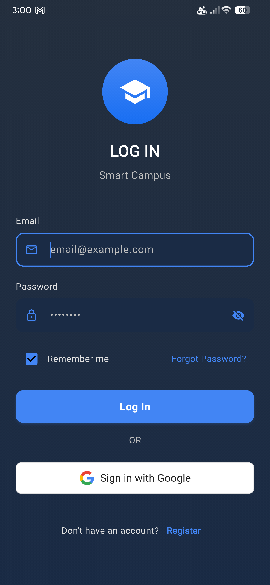
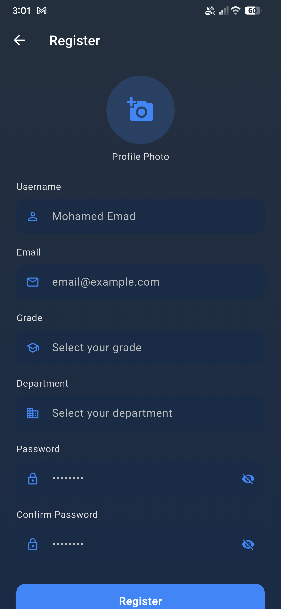
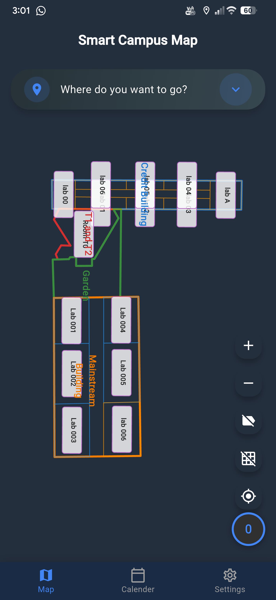
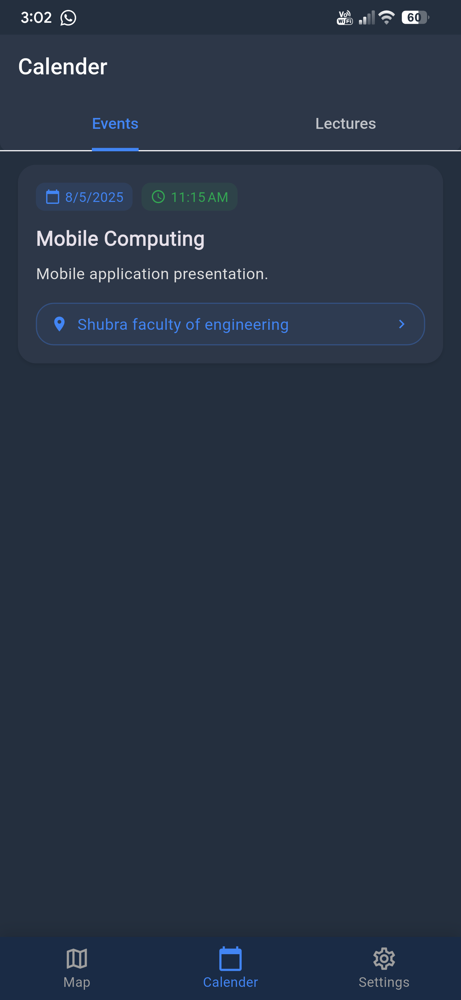
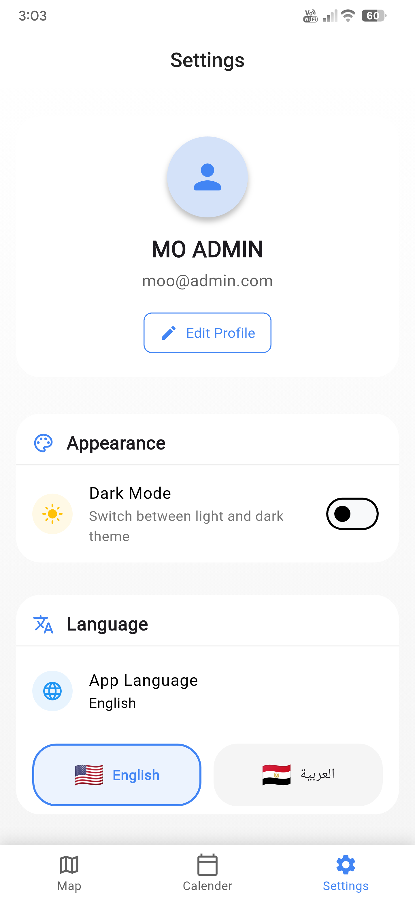
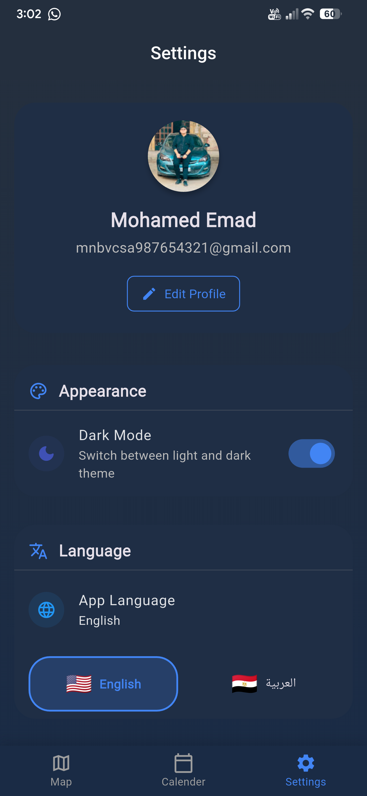

# Smart Campus Navigation & Event Hub 🏫

A comprehensive mobile application built with Flutter and Firebase to enhance the university experience. The app provides seamless navigation, event management, and real-time updates for students and faculty.

## Features
- 🔐 Secure Authentication (Email/Password + Google Sign-In)
- 🗓️ Real-time Event Management
- 🗺️ Interactive Campus Navigation
- 🔔 Push Notifications
- 📱 Cross-platform Support

## Technical Stack
- Flutter
- Firebase (Authentication, Firestore, Cloud Messaging)
- MVC Architecture
- Repository Pattern
- Singleton Pattern

## Getting Started
1. Clone the repository
2. Run `flutter pub get` to install dependencies
3. Configure Firebase project
4. Run the app using `flutter run`

## Project Structure
```
lib/
├── models/      # Data models
├── views/       # UI components
├── controllers/ # Business logic
├── services/    # API and Firebase services
└── utils/       # Helper functions and constants
```

## App Screenshots

<p align="center">
  
  
  
  
  
  
</p>

## Contributing
Feel free to submit issues and enhancement requests!
